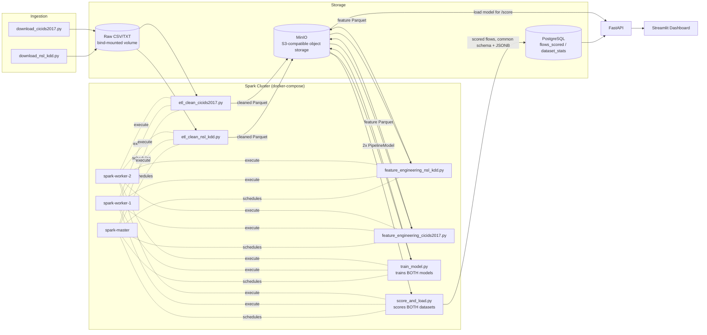

# Network Intrusion Detection

[](https://github.com/GMCavalheri/network-intrusion-detection/actions/workflows/tests.yml)

A distributed network intrusion detection pipeline built for a security data
engineering portfolio: the two standard public IDS benchmarks — **NSL-KDD**
and **CICIDS2017** — flow through a real Spark cluster for ETL and feature
engineering, train independent Spark MLlib classifiers, get served through
FastAPI, and are visualized in a Streamlit dashboard — all wired together
with Docker Compose.

**Stack:** Apache Spark 3.5 (standalone cluster) · MinIO (S3-compatible storage) ·
PostgreSQL · FastAPI · Streamlit · Docker Compose

Sibling project: [fraud-detection-spark](https://github.com/GMCavalheri/fraud-detection-spark)
(same stack, transaction fraud instead of network intrusions). This project
reuses that one's architecture deliberately, as a way of showing the same
engineering discipline applied to a different domain — not a find-and-replace.

## Why two datasets, and why two separate pipelines

NSL-KDD and CICIDS2017 are both standard, widely-cited public IDS
benchmarks, but they don't describe network traffic the same way:

- **NSL-KDD** — 41 pre-engineered *connection-level* features (KDD'99-style:
  `duration`, `protocol_type`, `service`, `flag`, `src_bytes`, `num_failed_logins`,
  `count`, `*_rate`, ...), no timestamps, and ships as a **pre-split**
  `KDDTrain+`/`KDDTest+` pair where the test set deliberately contains attack
  types that never appear in training.
- **CICIDS2017** — 78 *flow-level* features from CICFlowMeter (`Flow Duration`,
  `Total Fwd Packets`, `Flow Bytes/s`, TCP flag counts, ...), real per-day
  timestamps, captured across a full week of mixed benign/attack traffic.

These feature spaces don't overlap in any meaningful way, and forcing them
into one flat vector would misrepresent how NIDS actually work in practice —
a real detection engineer wouldn't feed KDD-style aggregates and raw
CICFlowMeter stats into the same model either. So this project trains **two
independent models** (own ETL → feature engineering → training → scoring
step, own `GBTClassifier` each) and unifies them only at the serving layer:
common fields (duration, bytes sent/received, protocol where available) are
normalized into shared Postgres columns, and each row's full,
dataset-specific feature vector is kept as a `raw_features` JSONB column —
the same "normalize the common bits, keep the raw event as JSON" pattern
real security pipelines use for heterogeneous log sources.

## Architecture



Why MinIO instead of just writing to a local folder: when the Spark driver
and executors are genuinely separate containers, each with its own
independent bind mount of the same host directory, Hadoop's local-filesystem
commit protocol is unreliable across their two views of "the same" path
(deterministic `Mkdirs failed` errors under concurrent writes). Object
storage sidesteps that whole class of problem — real distributed Spark
deployments use HDFS or S3 for this reason. Small single-file JSON reports
(`*_metrics.json`, `*_data_quality_report.json`) still write straight to the
bind mount since those come from plain driver-side Python code, not Spark's
distributed writer.

## The datasets, and what the ETL actually found

Both datasets are downloaded via [`data_ingestion/`](data_ingestion/), not
committed to the repo. Their official UNB download pages currently gate or
redirect instead of serving files directly, so the scripts default to
verified working mirrors (with the base URL overridable if a mirror moves).

| Dataset | Rows ingested | What's real vs. designed-in |
|---|---|---|
| NSL-KDD | 148,517 (125,973 train + 22,544 test) | **0 exact duplicates** (verified — NSL-KDD exists specifically to fix KDD'99's ~78% duplication problem). **17 attack types** appear in the test set that never occur in training — this is the dataset's whole point: testing generalization to unseen attacks, not memorization. |
| CICIDS2017 (3-day subset) | 1,448,366 raw → 1,333,886 cleaned | **114,442 exact duplicate rows** (7.9%) removed. **1,768 rows** had `Flow Bytes/s`/`Flow Packets/s` as the literal string `"Infinity"`/`"NaN"` in the raw CSV (division by zero when a flow's duration is 0 breaks both rate columns at once) — imputed to a `-1` sentinel. **38 rows** had a physically-invalid negative `Flow Duration` and were dropped. Column 55 ("Fwd Header Length") is a byte-for-byte duplicate of column 34 in the raw header, which makes Spark reject the file outright if read by name — confirmed against a real downloaded file, not just documentation, hence the positional CSV reading in `etl_clean_cicids2017.py`. |

CICIDS2017 defaults to a **3-day subset** (Monday benign baseline, Wednesday
DoS/Heartbleed, Friday DDoS — ~480MB) rather than the full 8-day/~885MB
release, to keep the pipeline runnable on a laptop. `data_ingestion/download_cicids2017.py --days ...`
picks any subset of the 8 available days.

**No within-day time-based split is possible for CICIDS2017** — this CSV
release has no `Timestamp` column at all (verified, not assumed) — so
train/test is split by *capture day* instead: Monday+Wednesday train, Friday
test. Splitting by day is arguably cleaner than a time-slice split anyway:
flows captured minutes apart in the same DDoS burst are highly
autocorrelated, so a within-file split risks leaking near-duplicate flows
across train/test in a way a different day can't.

## Detection approach

Two layers per dataset, shown together in the API/dashboard:

- **Rule-based flags** — reused/re-derived from each dataset's own
  discriminative signals rather than reimplementing the fraud project's
  velocity-window features, which don't apply here (neither dataset has an
  account/session identifier or timestamp to window over — each row is
  already a fully-aggregated connection/flow). NSL-KDD: repeated failed
  logins, `land` attacks, root-privilege signals, high connection rate,
  high error rate. CICIDS2017: zero-payload flows, SYN-without-ACK
  (flood-like), known malicious destination ports, one-directional
  (asymmetric) flows.
- **A trained model per dataset** — `GBTClassifier` (Spark MLlib), binary
  `is_attack` label, trained with class weighting for the (mild) imbalance
  in each dataset.

**NSL-KDD** (native KDDTrain+/KDDTest+ split):

| Metric | @0.5 threshold | @ best threshold (0.03) |
|---|---|---|
| AUC-ROC | 0.926 | — |
| AUC-PR | 0.939 | — |
| Precision | 0.932 | 0.902 |
| Recall | 0.714 | 0.920 |
| F1 | 0.809 | 0.911 |

Detection rate on the **3,750 test rows whose attack type never appears in
training**: **55.3%** (2,074 caught) — the headline number for a dataset
whose entire design goal is testing generalization to novel attacks. Top
predictive features: `service` (52%), `src_bytes` (26%) — together over
three-quarters of the model's decision weight.

**CICIDS2017** (day-based split: train on Monday+Wednesday, test on Friday):

| Metric | @0.5 threshold | @ best threshold (0.03) |
|---|---|---|
| AUC-ROC | 0.978 | — |
| AUC-PR | 0.927 | — |
| Precision | 0.391 | 0.939 |
| Recall | 0.001 | 0.999 |
| F1 | 0.002 | 0.968 |

This is a real finding, not a bug (see `train_model.py`'s `_threshold_curve`
docstring for how it was diagnosed): a model trained on Wednesday's DoS
variants (GoldenEye/Hulk/Slowloris/Heartbleed) scores Friday's actual DDoS
flows at a **median probability of ~0.04**, well below the default 0.5 cutoff
— despite ranking them well above benign traffic on average (hence the
strong AUC). A security team deploying this would tune the alert threshold
to their false-positive budget, not default to 0.5; the dashboard's Model
Performance page shows the full precision/recall/F1-vs-threshold curve, not
just one arbitrary operating point. It's a concrete illustration of why AUC
alone doesn't tell you whether a model is deployment-ready, and why
train/test *distribution* shift (different attack subtypes, different
capture days) matters as much as overall accuracy — arguably more relevant
to a Detection Engineer's actual job than a clean 95%+ F1 would have been.

## Running it

Requires Docker and Docker Compose. Every service has an explicit
`mem_limit`; steady-state (everything except the one-shot pipeline job)
totals **~6GB**, ~7.5GB including a running pipeline job — see
`docker-compose.yml`.

```bash
# 1. Download NSL-KDD (~20MB) and a 3-day CICIDS2017 subset (~480MB)
python3 -m venv .venv-ingest && .venv-ingest/bin/pip install -r data_ingestion/requirements.txt
.venv-ingest/bin/python data_ingestion/download_nsl_kdd.py
.venv-ingest/bin/python data_ingestion/download_cicids2017.py
```

```bash
# 2. Copy env defaults and bring up the storage layer + Spark cluster
cp .env.example .env
docker compose up -d postgres spark-master spark-worker-1 spark-worker-2 minio minio-init
```

```bash
# 3. Run the full ETL -> feature engineering -> training -> scoring pipeline
#    for BOTH datasets (one-shot job, not a long-running service)
docker compose run --rm spark-pipeline
```

```bash
# 4. Bring up the API and dashboard
docker compose up -d api frontend
```

Then open:
- **Streamlit dashboard** — http://localhost:8501
- **FastAPI docs** — http://localhost:8000/docs
- **Spark master UI** — http://localhost:8080 (see the cluster's completed jobs)
- **MinIO console** — http://localhost:9001 (`minioadmin` / `minioadmin` by default)

## Project structure

```
data_ingestion/        download_nsl_kdd.py, download_cicids2017.py (public dataset mirrors)
spark_jobs/             etl_clean_*, feature_engineering_*, train_model, score_and_load
  common.py             shared Spark session config, schema constants, cross-dataset taxonomy
api/                    FastAPI service: flow queries, per-dataset stats, live /score
frontend/               Streamlit dashboard (5 sections, dataset-aware)
postgres/init.sql       serving-layer schema (flows_scored w/ JSONB raw_features, dataset_stats)
docker-compose.yml      spark-master/worker x2, minio, postgres, api, frontend
```

## Testing and logging

Each of the three Python components (`data_ingestion`, `spark_jobs`, `api`)
has its own pytest suite (89 tests total: 15 + 41 + 33) and runs
independently in CI on every push — see the badge above. Run them locally:

```bash
pip install -r data_ingestion/requirements-dev.txt && pytest data_ingestion/tests/
pip install -r spark_jobs/requirements-dev.txt      && (cd spark_jobs && pytest tests/)
pip install -r api/requirements-dev.txt              && (cd api && pytest tests/)
```

The Spark tests use a real local `SparkSession` fixture on tiny in-memory
DataFrames rather than mocking Spark itself, and several reproduce the
*exact* shape of real data-quality issues found by running against the
actual downloaded datasets (CICIDS2017's duplicate header column, its
Infinity/NaN rate values, NSL-KDD's headerless CSV layout) — not just
plausible-looking fixtures. The API tests mock the DB/inference layer, since
the point there is request handling and business logic, not a live database.

Two real bugs were caught only by running the *full* pipeline against real
downloaded data (not the unit tests, which used small synthetic fixtures
that happened not to trigger them): `GBTClassifier`'s default `maxBins=32`
is too small for NSL-KDD's 70-category `service` feature, and
`VectorAssembler(handleInvalid="keep")` turns a null numeric input into
`NaN` in the assembled vector, which `GBTClassifier` rejects outright — so
CICIDS2017's Infinity/NaN values are imputed to a concrete `-1` sentinel
rather than left null. Both are fixed in `spark_jobs/train_model.py` and
`etl_clean_cicids2017.py`, with the reasoning left in comments.

All four services log to both console (`docker logs`) and a rotating file
under the mounted `logs/` volume (`logs/spark_jobs/`, `logs/api/`,
`logs/frontend/`) — useful since the Spark pipeline runs as a one-shot
container that's discarded (`docker compose run --rm`) once it exits.

## Design notes / known trade-offs

- **`/score` loads a real local SparkSession inside the API container** for
  each dataset, running the exact `PipelineModel` the cluster trained,
  rather than a re-implemented copy — same trade-off (a few seconds of
  first-call latency, guaranteed train/serve consistency) as the fraud
  project.
- **CICIDS2017 has no protocol column and no source/destination IP** in this
  CSV release (`MachineLearningCVE`-style, verified against the real file) —
  a real coverage gap of the public dataset, not a bug in this project. It
  also means there's no entity to group flows by for the kind of
  account-level velocity features the fraud project computes.
- **Neither dataset has a per-row timestamp usable for time-series charting**
  the way the fraud project's daily fraud-rate chart does (NSL-KDD has none
  at all; CICIDS2017's Timestamp column isn't present in this CSV release).
  `/stats/datasets` reports per-`(dataset, split)` rollups instead of
  pretending a time series exists.
- **Live-demo forms expose a hand-picked subset of each model's features**
  (14 of 41 for NSL-KDD, 14 of 78 for CICIDS2017 — see `api/constants.py`),
  chosen from the trained models' real feature importances; everything else
  defaults to a typical/unremarkable baseline. Requiring all 41 or 78 raw
  fields from a user wouldn't be a usable demo.
- **CICIDS2017 defaults to a 3-day, ~480MB subset**, not the full 8-day
  dataset, for the same reason the fraud project caps its synthetic data at
  1.5M rows: large enough to meaningfully exercise Spark's distributed
  processing, small enough to run comfortably in Docker on a laptop. Pass
  `--days ...` to `download_cicids2017.py` for a different subset.
